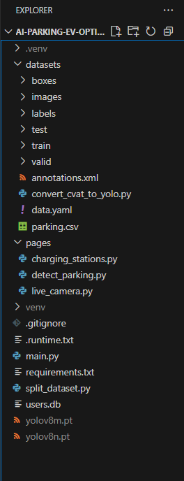

# 🚗 AI Parking & EV Assistant  

**Smart Parking and EV Charging Solution powered by AI and Streamlit**  
> Built for **LuminHacks 2025**  

---

## 🌟 Inspiration  

Finding parking spots in crowded cities or locating nearby EV charging stations can be frustrating.  
As urban mobility grows, optimizing parking and charging infrastructure with AI becomes essential.  

**AI Parking & EV Assistant** was inspired by this challenge — combining **computer vision**, **real-time mapping**, and **geolocation intelligence** to make parking and EV charging smarter and more sustainable.  

It leverages **YOLOv8** for parking-slot detection and the **Google Maps API** to fetch EV charging stations — all wrapped in a sleek, interactive **Streamlit dashboard**.  

---

## 🧠 What It Does  

### 🅿️ Parking Detection  
Upload an image or video of a parking lot. The app uses **YOLOv8 (Ultralytics)** to detect occupied and empty spots with real-time bounding boxes.  

### ⚡ EV Charging Station Finder  
Enter your location to find nearby charging stations. Uses **Google Maps API** and **Folium** for an interactive map and distance visualization.  

### 📷 Live Camera Detection  
Activate your webcam to monitor parking occupancy live — ideal for smart-parking automation systems.  

### 🏠 Dashboard  
Navigate seamlessly between modules: **Parking Detection**, **EV Stations**, **Live Camera**, and **Map Overview** — all in a unified Streamlit interface.  

---

## 🧩 Tech Stack & Tools  

| Category | Technology |
|-----------|-------------|
| Framework | Streamlit |
| AI Model | YOLOv8 (Ultralytics) |
| Dataset | Kaggle – Parking Slot Detection Dataset |
| Mapping | Google Maps API, Folium |
| Libraries | OpenCV, NumPy, Pandas, Streamlit-Folium |
| Languages | Python |
| Environment | Streamlit Cloud / Localhost |

---

## ⚙️ Workflow Summary  

1. Trained a **YOLOv8** model on a Kaggle parking-slot dataset.  
2. Integrated model inference into **Streamlit** for image/video uploads and live camera detection.  
3. Connected **Google Maps API** to fetch EV station data and distances.  
4. Used **Folium** and **OpenCV** for map overlays and visualization.  
5. Deployed on **Streamlit Cloud** for instant browser access.  

---

## 💻 Project Structure  



---

### 🔧 1. Clone the Repository  
```bash
git clone https://github.com/yukthagangadhari5/ai-parking-ev-optimizer.git
cd ai-parking-ev-optimizer
🧰 2. Install Dependencies
bash
Copy code
pip install -r requirements.txt
▶️ 3. Run the App
bash
Copy code
streamlit run main.py
🌐 4. Access in Browser
Open your browser and go to:
👉 http://localhost:8501